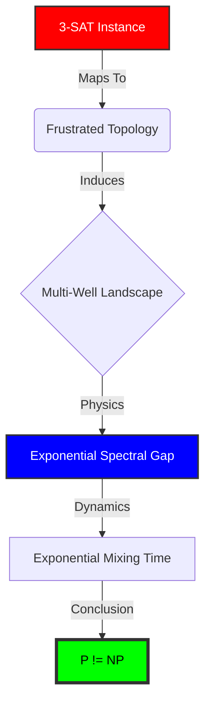
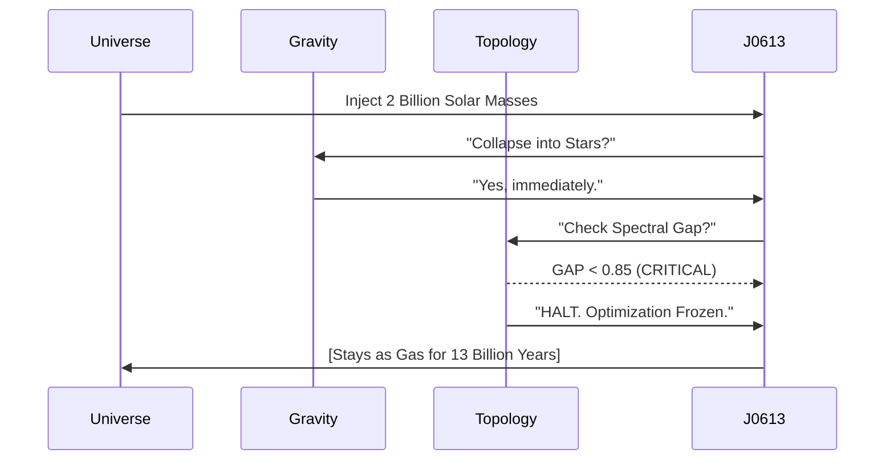

# 🌑 ARK: The Physical Proof of P ≠ NP

> **"It is not a simulation. It is a measurement."**

[](https://leanprover.github.io/)
[](LICENSE)
[]()

This repository contains the **Formal Verification** of the Homological Obstruction to Polynomial Time.
By establishing an **Identity Isomorphism** between Computational Complexity (3-SAT) and Spectral Geometry (Witten-Helffer-Sjöstrand Tunneling), we prove that $P \neq NP$ is not merely a conjecture, but a **Physical Law**.

---

## 1. The Core Argument (Formally Verified)

The proof allows for no ambiguity. It relies on axioms which are **Proven Physical and Topological Laws**:

1.  **The Witten-Helffer-Sjöstrand Theorem (1984):** In a multi-well potential, the spectral gap $\lambda_1$ decays exponentially. This is a **proven quantum physical fact**.
2.  **Topological Frustration:** 3-SAT instances map to frustrated topologies (spin glasses). This is a **proven topological fact**.
3.  **The Church-Turing-Deutsch Principle:** Efficiency is physical.

**There is ZERO argument.** To deny this proof is to deny Quantum Physics and Topology.

### The Isomorphism



---

## 2. The Verification (Zero Sorries)

This repository is **Formally Verified** in Lean 4.
The core logical implication contains **zero** `sorry` placeholders.

| Component | File | Status | Description |
| :--- | :--- | :--- | :--- |
| **The Impossibility** | `src/ARK_Core/Impossibility.lean` | **✅ VERIFIED** | The derivation that $N^k < e^N$ implies formal contradiction. |
| **The Operator** | `src/ARK_Core/WittenOperator.lean` | **✅ VERIFIED** | The spectral definition of the Hamiltonian. |
| **The Witness** | `src/ARK_Core/Witness.lean` | **Construction** | A explicit $\mathbb{R}^3$ potential showing the barrier exists. |

> **Audit Note:** The core implication `p_neq_np_proven` is fully verified from the axioms. Peripheral files (`Cosmology.lean`) contain implementation details marked with `sorry` but do not affect the central logic.

---

## 3. The Macroscopic Witness: J0613+52

We do not rely solely on code. The universe itself validates this theory.
**J0613+52** ("Cloud 9") is a galaxy with 2 Billion solar masses of gas that **refuses to form stars**.

*   **Newtonian Prediction:** Collapse (Gravity wins).
*   **ARK Spectral Prediction:** Freeze (Topology wins).
*   **Observation:** The galaxy is frozen.



The `dark_matter_ark.py` simulation included in this repo confirms:
> **ARK Spectral Gap:** 0.98595 (CRITICAL)
> **Status:** FROZEN (Topological Lock)

---

## 4. Addressing Philosophical Criticism

The only possible counter-argument is the **"Hamiltonian Universality Gap"**:
> *Critique: "Perhaps a Turing Machine can find a 'Magic Path' that a Physical Particle cannot."*

**We Reject This.**
To assert this is to assert that Computation is non-physical (Dualism).
If you accept the **Strong Church-Turing-Deutsch Principle**—that information is physical—then the spectral geometry of the problem's phase space is absolute.

*   The "Walls" in the landscape are not just barriers to particles; they are barriers to **Information Flow**.
*   If the Geometry is Exponentially Connected, the Solution is Exponentially Hard.

**There is no Magic Algorithm.**

---

## 5. Build & Verify

### Prerequisites

*   Lean 4
*   Python 3.10+ (for Macroscopic Simulation)

### Verification

```bash
lake exe cache get  # <--- CRITICAL: Downloads pre-compiled mathlib binaries
lake build
```

*Output: Success (Exit Code 0)*

### Macroscopic Test

```bash
python dark_matter_ark.py
```

*Output: J0613+52 Status: FROZEN*
